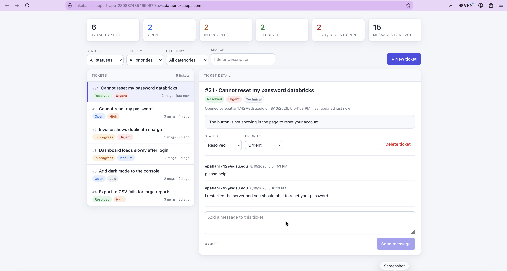
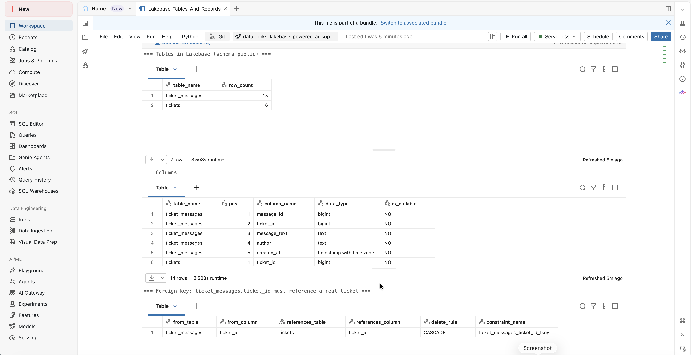
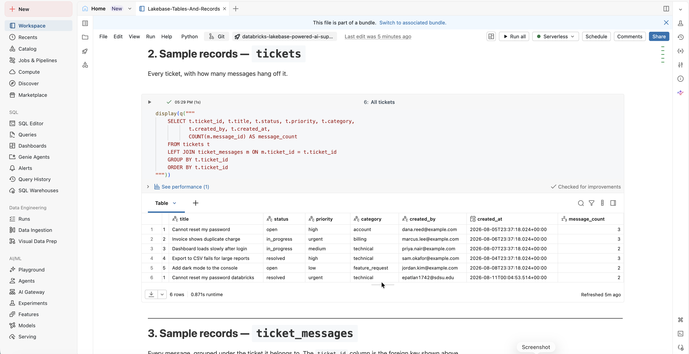
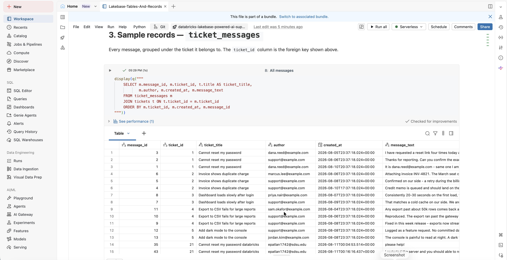

# Lakebase-Powered Support App

An internal support system running on **Databricks Apps**, with every ticket and message
stored in **Lakebase** (Databricks-managed Postgres). Users open tickets, hold a threaded
conversation on them, filter and search, change status, and delete a ticket behind a
confirmation step.

There is no hard-coded application data anywhere: the page is empty until Postgres answers,
and a browser refresh shows exactly what the database holds.

The HTTP surface is a plain JSON API under `/api/*`, with the HTML page as just one of its
clients — later boot-camp projects can point an AI agent at the same endpoints.

**Live app:** https://lakebase-support-app-2808874854650870.aws.databricksapps.com

Databricks Apps cannot be made anonymously public, so that link only opens for signed-in
users in the workspace's account. Everyone else gets an authentication prompt.

---

## Contents

| Path | What it is |
|---|---|
| `app.py` | Flask app: all routes, validation, statistics |
| `lakebase.py` | Postgres connection helper (secret resolution, query/write helpers) |
| `seed.py` | Applies `sql/01_schema.sql` + `sql/02_seed_data.sql`, then reports what landed |
| `setup_secrets.py` | One-time: stores the Lakebase URL in a Databricks secret scope |
| `templates/index.html` | The whole UI — one file, no build step, no CDN |
| `sql/00_grant_app_role.sql` | `GRANT CREATE ON SCHEMA public` — required once, see step 5 |
| `sql/01_schema.sql` | `tickets` + `ticket_messages` |
| `sql/02_seed_data.sql` | Sample data (idempotent) |
| `sql/03_verify.sql` | Queries that prove the app is really writing to Lakebase |
| `app.yaml` | Databricks Apps config (command + env + secret resource) |

### Resource names used throughout

| Thing | Value |
|---|---|
| Lakebase instance | `support-db` |
| Postgres database | `databricks_postgres` (Lakebase default) |
| Postgres role | `support_app` (native password auth) |
| Secret scope / key | `support` / `lakebase-url` |
| App resource key | `lakebase-url` |
| Databricks App name | `lakebase-support-app` |

---

## Data model

```
tickets                              ticket_messages
─────────────────────────            ────────────────────────────────
ticket_id   BIGSERIAL  PK    ◄───────  ticket_id    BIGINT  FK, ON DELETE CASCADE
title       TEXT                       message_id   BIGSERIAL PK
description TEXT                       message_text TEXT
status      TEXT  CHECK                author       TEXT
priority    TEXT  CHECK                created_at   TIMESTAMPTZ
category    TEXT  CHECK
created_by  TEXT
created_at  TIMESTAMPTZ
updated_at  TIMESTAMPTZ
```

- `status` ∈ `open`, `in_progress`, `resolved`, `closed`
- `priority` ∈ `low`, `medium`, `high`, `urgent`
- `category` ∈ `general`, `billing`, `technical`, `account`, `feature_request`

The `CHECK` constraints are the real guarantee; `app.py` validates the same sets first so a
bad value comes back as a readable `400` rather than a constraint violation.

`ON DELETE CASCADE` is what makes deleting a ticket a single statement — a message thread
can never outlive the ticket it belongs to.

---

## Setup

### 1. Create the Lakebase instance

Workspace → **Catalog → Lakebase** (or search "Lakebase") → **Create database instance**.
Name it `support-db`, accept the default capacity, and wait for **Available**.

### 2. Create a password role

Open the instance → **Roles & Databases**.

1. **Enable native (password) authentication.** Some instances only allow OAuth tokens by
   default; password auth is what gives the role a static, non-expiring password, so the app
   needs no token-refresh logic at all.
2. **Add role** → auth method **Password** → name it `support_app` → let Databricks generate
   the password.
3. Copy the connection URL:

```
postgresql://support_app:<password>@<host>:5432/databricks_postgres?sslmode=require
```

> ⚠️ **Paste the host whole.** It already ends in `.database.<region>.cloud.databricks.com`.
> Appending another domain produces a DNS failure that `psycopg2` reports as
> *"password authentication failed"* — which sends you off rotating a password that was
> never wrong. Sanity-check with `nslookup <host>`.

### 3. Store the URL as a Databricks secret

```bash
export DATABRICKS_HOST=https://<your-workspace>.cloud.databricks.com
export DATABRICKS_TOKEN=<your-pat>          # Settings → Developer → Access tokens

LAKEBASE_URL='postgresql://support_app:…' python setup_secrets.py
```

Or run it inside a Databricks notebook **Python** cell, where auth is automatic:

```python
exec(open("setup_secrets.py").read())
```

Creates scope `support`, key `lakebase-url`. Safe to re-run. It prints key *names* only,
never values.

> `%sh python setup_secrets.py` hangs forever — that subshell has no TTY, so the prompt
> never reaches you. Use a Python cell.

### 4. Grant the role permission to create tables

Run `sql/00_grant_app_role.sql` in the **Lakebase instance's own query editor** (open it
from the database instance page):

```sql
GRANT CREATE ON SCHEMA public TO support_app;
```

PostgreSQL 15 stopped granting `CREATE` on schema `public` to every role, so without this
the app's first write fails with `permission denied for schema public`.

> Do **not** run it in a notebook `%sql` cell. That routes to Unity Catalog, which reads
> `support_app` as a Databricks principal and fails with `PRINCIPAL_DOES_NOT_EXIST`. The
> syntax is valid in both dialects, which is exactly what makes the mistake easy to miss.

### 5. Create the schema and load sample data

Either paste `sql/01_schema.sql` and `sql/02_seed_data.sql` into the same query editor, or
run them from your terminal:

```bash
cp .env.example .env         # then fill in LAKEBASE_URL
uv venv && source .venv/bin/activate
uv pip install -r requirements.txt

python seed.py
```

`seed.py` prints the loaded tickets and checks the assignment's minimums (≥ 3 tickets,
≥ 2 statuses, ≥ 2 messages each). Both SQL files are safe to re-run: the schema is all
`IF NOT EXISTS`, and the sample data only inserts when the tables are empty, so it will
never duplicate itself or overwrite real tickets.

### 6. Run it locally

```bash
python app.py        # http://localhost:8000
```

---

## Deploy to Databricks Apps

1. **Workspace → Create → Git folder**, pointed at this repository.
2. **Compute → Apps → Create app → Custom**, name it `lakebase-support-app`, and set the
   source to that folder. Databricks reads `app.yaml` automatically.
3. **Edit → App resources → + Add resource → Secret**:

   | Resource key | Scope | Key | Permission |
   |---|---|---|---|
   | `lakebase-url` | `support` | `lakebase-url` | Can read |

   That resource key is exactly what `valueFrom:` in `app.yaml` names, and Databricks
   resolves it to the **decrypted** value. Adding the resource is also what grants the app's
   service principal read access on the secret — which is why there is no
   `databricks secrets put-acl` step here.

4. **Deploy.** The URL looks like
   `https://lakebase-support-app-<number>.<region>.databricksapps.com`.

To ship a change: Git folder → **Pull**, then **Deploy** again.

### How the app authenticates to Postgres

The app's service principal never gets a Postgres identity of its own. It reads the secret,
and connects as the `support_app` Postgres role using the password inside the DSN. If the
secret resource is missing, `lakebase.py` falls back to fetching the secret through the SDK
(which then does require the service principal to hold READ on the `support` scope). The
first database call logs which path it took:

```
Lakebase URL resolved from the LAKEBASE_URL environment variable   ← resource path
Lakebase URL resolved from secret scope support/lakebase-url        ← SDK fallback
```

---

## API

| Method | Path | Notes |
|---|---|---|
| `GET` | `/healthz` | liveness probe |
| `GET` | `/api/tickets` | optional `?status=` `?priority=` `?category=` `?q=` |
| `POST` | `/api/tickets` | `title` required; optional `description`, `priority`, `category`, `message_text` |
| `GET` | `/api/tickets/<id>` | ticket + full message thread |
| `PATCH` | `/api/tickets/<id>` | any of `status`, `priority`, `category`, `title`, `description` |
| `DELETE` | `/api/tickets/<id>` | requires `{"confirm": true}` |
| `GET` | `/api/tickets/<id>/messages` | oldest first |
| `POST` | `/api/tickets/<id>/messages` | `message_text` required |
| `GET` | `/api/stats` | totals plus per-status / priority / category breakdowns |

`created_by` and `author` come from the signed-in Databricks user — the `X-Forwarded-Email`
header that Apps injects, falling back to the SDK's `current_user` and then to
`LOCAL_USER_EMAIL` for local runs.

---

## Verify it works

```bash
curl -s localhost:8000/healthz                                   # {"status":"ok"}
curl -s localhost:8000/api/tickets | jq length                   # 5
curl -s localhost:8000/api/stats | jq
curl -s 'localhost:8000/api/tickets?status=open' | jq '.[].status'

TID=$(curl -s -X POST localhost:8000/api/tickets -H 'Content-Type: application/json' \
  -d '{"title":"Printer offline","priority":"low","category":"technical"}' | jq .ticket_id)

curl -s -X POST localhost:8000/api/tickets/$TID/messages -H 'Content-Type: application/json' \
  -d '{"message_text":"Tried restarting, no change."}' | jq

curl -s -X PATCH localhost:8000/api/tickets/$TID -H 'Content-Type: application/json' \
  -d '{"status":"in_progress"}' | jq .status                     # "in_progress"

# Validation — each of these should be a 400 with a readable message
curl -s -X POST  localhost:8000/api/tickets -H 'Content-Type: application/json' -d '{"title":"ab"}'
curl -s -X PATCH localhost:8000/api/tickets/$TID -H 'Content-Type: application/json' -d '{"status":"nope"}'
curl -s -X POST  localhost:8000/api/tickets/999999/messages -H 'Content-Type: application/json' \
  -d '{"message_text":"x"}'                                      # 404

# Delete refuses without explicit confirmation
curl -s -X DELETE localhost:8000/api/tickets/$TID -H 'Content-Type: application/json' -d '{}'
curl -s -X DELETE localhost:8000/api/tickets/$TID -H 'Content-Type: application/json' -d '{"confirm":true}'
```

**In the browser** (locally, then again on the deployed URL): the ticket list loads, clicking
a ticket shows its messages, the New-ticket dialog creates one, the composer adds a message,
the status dropdown saves on change. Then **hard-refresh** — everything is still there,
because none of it was ever client-side state.

**Straight from the database**, run `sql/03_verify.sql` in the Lakebase query editor to see
the same rows the UI just wrote.

---

## Bonus features

| Challenge | Where |
|---|---|
| Priority and category | `tickets.priority` / `tickets.category`, editable from the detail pane |
| Filtering by status | Toolbar filters for status, priority, category, plus free-text search over title and description |
| Input validation and helpful errors | `_clean_text` / `_clean_choice` in `app.py`; messages name the field and list the valid values. Backed by `CHECK` constraints |
| Ticket statistics | `GET /api/stats` and the tile row: totals, per-status counts, open high/urgent, messages and average per ticket |
| Delete with confirmation | A dialog naming the ticket and its message count, and a server-side `{"confirm": true}` requirement so a stray `DELETE` cannot destroy a thread |
| Visual design | Two-column console, status/priority colour system, automatic light and dark theme, responsive down to one column |

---

## Screenshots

<!-- Drop the .png files into docs/img/ and these render automatically.
     See docs/img/README.md for exactly what to capture. -->

**The deployed app** — ticket list, message thread, filters, and statistics.



**The Lakebase tables** — row counts, columns, and the foreign key from
`ticket_messages.ticket_id` to `tickets.ticket_id` with `ON DELETE CASCADE`.



**Sample records — `tickets`** — every ticket with its status, priority, category and
message count.



**Sample records — `ticket_messages`** — every message, joined to the ticket it belongs to.



---

## Reflection

**What was the most difficult part?**
Wiring up the credentials, not writing the app. Lakebase needs its own Postgres role and
password, that password has to go into a Databricks secret scope, and the deployed app
only sees it through a Secret app resource whose key must match `app.yaml` exactly.

**How is Lakebase different from storing this data in a traditional analytics table?**
Lakebase is a real transactional database, so it enforces the link between `tickets` and
`ticket_messages`, deletes a message thread along with its ticket, and updates a single
row in milliseconds. A Delta table in Unity Catalog is built for scanning millions of rows
at once — it cannot enforce that relationship, and it is not meant for editing one record
at a time.

**What feature would you add next?**
Search across message text, so a ticket can be found by what people actually wrote in it
rather than only by its title — the data is already there, and it is the natural first
step toward the AI-agent work later in the boot camp.

---

## Troubleshooting

| Symptom | Cause |
|---|---|
| App stuck "starting" forever | Not bound to `DATABRICKS_APP_PORT`. `app.py` reads it first, ahead of any local default — keep it that way. |
| `permission denied for schema public` | Step 4 (`GRANT CREATE`) was skipped. |
| `password authentication failed` right after setup | Usually a mangled host, not a bad password — see the warning in step 2. |
| `PRINCIPAL_DOES_NOT_EXIST` on the GRANT | It ran in a notebook `%sql` cell against Unity Catalog instead of the Lakebase query editor. |
| Data routes return 500 | Check app logs. Error responses deliberately omit the exception text, because a `psycopg2` connection failure puts the entire DSN — password included — into its message. |
| Deployed app can't read the secret | The Secret app resource is missing, so it fell back to the SDK path; either add the resource or grant the service principal READ on the `support` scope. |

---

## Security notes

- No credential appears in this repository. The DSN lives in a Databricks secret scope and,
  for local development only, in a gitignored `.env`. `.env.example` ships placeholders.
- `.gitignore` covers `.env` *and* `.env.*` (plain `.env` does not match `.env.local` or
  `.env.bak`, which editors create readily), with `!.env.example` allowed back in.
- Error responses never echo exception text, for the DSN-leak reason above.
- All SQL uses parameter binding — no string-interpolated user input.
- The UI builds every row with `createElement` + `textContent`, never `innerHTML`
  interpolation, so a ticket titled `` renders as text rather than running.
- Databricks Apps cannot be made public: access is `CAN USE` / `CAN MANAGE`, and the
  broadest audience is the users in your own account.
